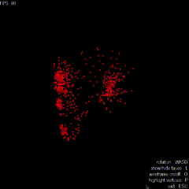
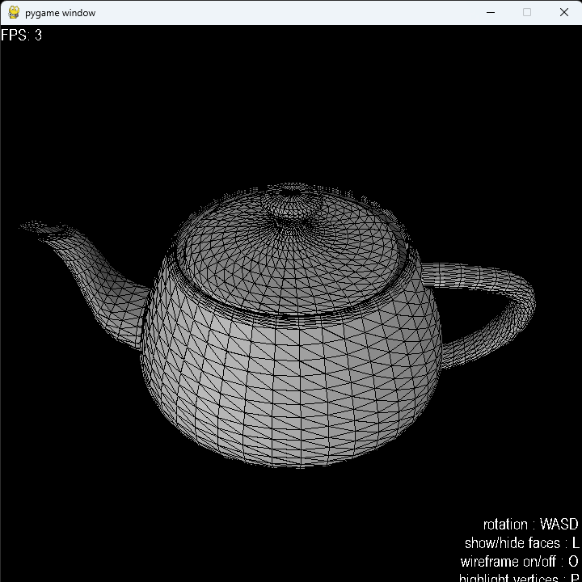
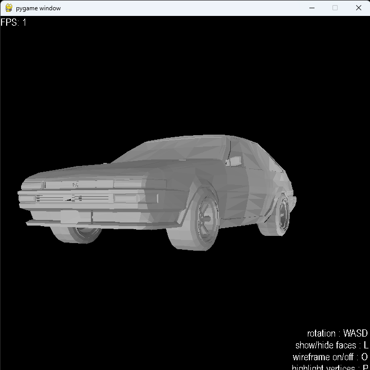

# Python .obj Viewer

Started this out of boredom on the ferry one day, wanted to see if I could render some 3D models using pygame's 2D polygons. Started with some manually defined cube vertices, applied some matrix mults with numpy and managed to convert from 3D to screen coordinates. Later added functions for loading .obj files, basic shading, and model rotations. Fairly impractical, but a fun experiment.

Usage:

```
Python main.py <path-to-file>
```

Example with:

```
Python main.py testObjects/monkey.obj

```



Other examples:





Obvious performance decreases with higher numbers of vertices, which I suppose I should've expected, when the "vertex shader" is a python for loop with several matrix operations.
